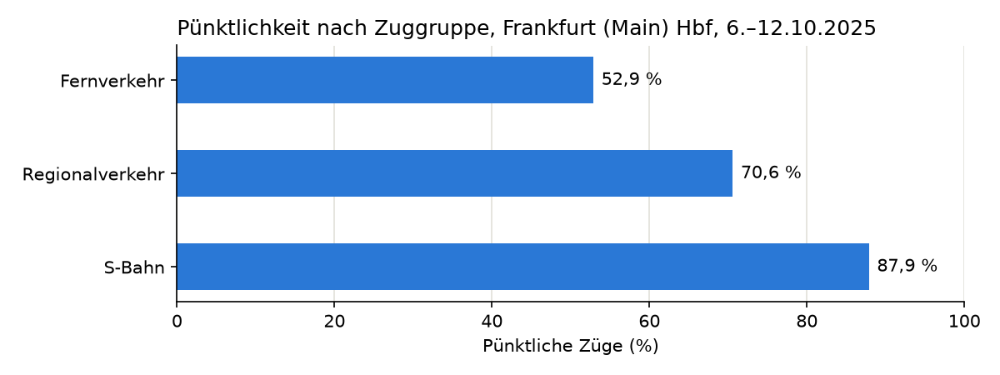

# Pünktlichkeit am Frankfurter Hauptbahnhof

Mein erstes Datenprojekt. Ich habe untersucht, wie pünktlich die Züge am Frankfurt (Main) Hbf sind.

## Daten

- Quelle: [piebro/deutsche-bahn-data](https://huggingface.co/datasets/piebro/deutsche-bahn-data) (Deutsche Bahn, Lizenz CC BY 4.0)
- Zeitraum: Montag, 6. bis Sonntag, 12. Oktober 2025
- 13.055 Halte am Frankfurt (Main) Hbf

Pünktlich heißt: weniger als 6 Minuten Verspätung (wie bei der Deutschen Bahn). Ausgefallene Züge (4,2 %) zähle ich nicht.

## Fragen und Ergebnisse

### 1. Wie viele Züge sind pünktlich?

75,9 % der Züge waren pünktlich. Am Wochenende waren die Züge pünktlicher (Sonntag: 87,9 %) als unter der Woche (Montag: 70,2 %).

### 2. Welche Züge haben die meisten Verspätungen?

Der Fernverkehr (ICE, IC ...). Nur 52,9 % der Fernzüge waren pünktlich. Die S-Bahn war am pünktlichsten (87,9 %).



### 3. Um wie viel Uhr gibt es die meisten Verspätungen?

Am Abend. Um 20 Uhr waren 36,7 % der Züge verspätet. Am frühen Morgen (4 bis 6 Uhr) waren weniger als 15 % verspätet.

## Was ich gelernt habe

- SQL mit DuckDB: `GROUP BY`, `CASE WHEN`, `VIEW`, `PIVOT`
- Datenqualität prüfen (ausgefallene Züge, zu frühe Züge)
- Diagramme mit matplotlib
- Git

## Werkzeuge

Python, DuckDB (SQL), Jupyter Notebook, matplotlib, Git

## Projekt starten

1. Daten herunterladen und in den Ordner `data/` legen:

   ```
   curl -L -o data/data-2025-10.parquet "https://huggingface.co/datasets/piebro/deutsche-bahn-data/resolve/main/monthly_processed_data/data-2025-10.parquet"
   ```

2. Pakete installieren:

   ```
   pip install duckdb pandas matplotlib jupyter
   ```

3. `notebooks/analyse.ipynb` öffnen und alle Zellen ausführen.
